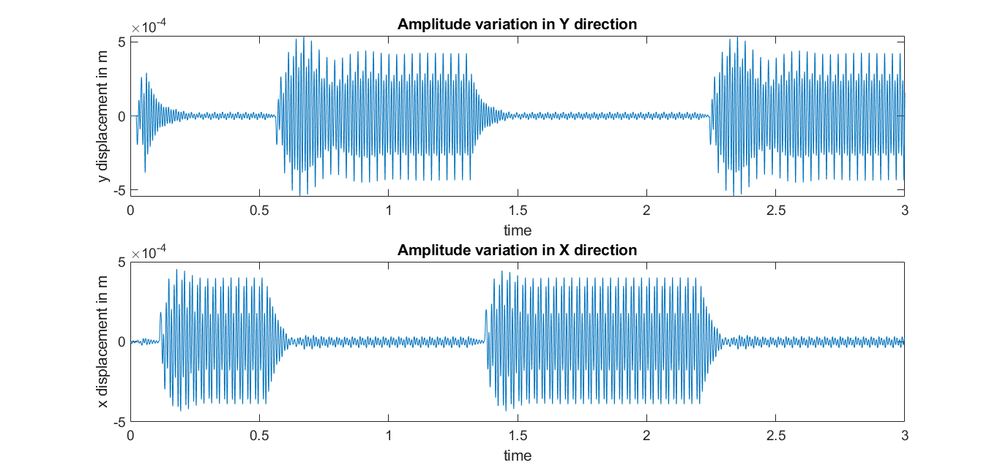

# Modelling of chatter vibration in thin-wall milling and its effect on surface roughness of job

This project was a part of the Production Techniques-2 course at my university. The aim was to write shum kind ofh MATLAB script to simulate the chatter vibrations. The phenomenon for a 2-DOF model is represented by a second order **Delay Differential Equation**. With absolutely no clue on how to solve DDEs and minimal resources available, I had to reverse engineer the example codes and understand the documentation.

## Results

## References

  - https://www.youtube.com/watch?v=TCWrD3cZG9s&ab_channel=Yarpiz
  - A review of chatter vibration research in milling - https://doi.org/10.1016/j.cja.2018.11.007
  - Machining Chatter Analysis for High Speed Milling Operations - https://hal.archives-ouvertes.fr/hal-00748570
  - Machining Chatter Analysis for High Speed Milling Operations -  https://iopscience.iop.org/article/10.1088/1757-899X/247/1/012014 ; doi:10.1088/1757-899X/247/1/012014
  - Jacek Kierzenka (2020). Tutorial on solving DDEs with DDE23 (https://www.mathworks.com/matlabcentral/fileexchange/3899-tutorial-on-solving-ddes-with-dde23), MATLAB Central File Exchange. Retrieved December 1, 2020.

Also I raised a question on MATLAB forum if you wanna look at it. 
> "Hopefully somebody will answer it one day." :)
- https://www.mathworks.com/matlabcentral/answers/663668-solving-system-of-delay-differential-equations-with-two-independent-variables-in-each-equation  

